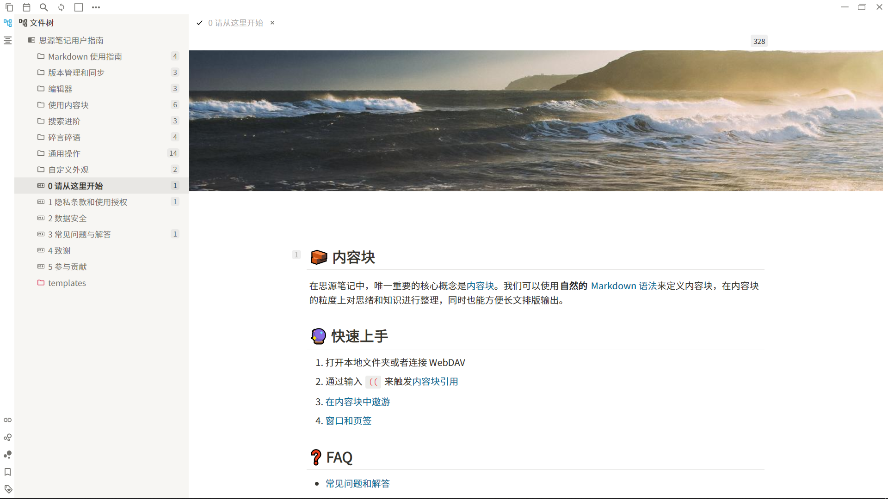

# Siyuan-Notion-Light

## 预览图

## 简介

- 参考Notion的Light主题
- 所做的工作
  - 题头图
    - 暂时用纯css配合[Cover模板](https://github.com/zqhjl/siyuan-template-NotionCover)显示题头图
    - 考虑到部分用户不一定需要该功能，因此默认注释，需要手动去除注释，[具体教程见](https://ld246.com/article/1615972006481)
  - 整体配色更改
  - 样式更改
    - 编辑器样式（与[Atom OneDark](https://github.com/zqhjl/Siyuan-Atom-OneDark)主题大部分一致）
    - UI样式
      - 主要是各类页签列表的悬浮、选中、点击等效果
  - 整体字体更换

## 历史版本

### 1.6.2

- 调整侧边栏顶栏的样式
- 修复命令菜单的字体颜色
- 修复任务列表的样式
- 由于代码块支持即使渲染了高亮，因此去除此前的不显示预览的功能
- 调整块标识菜单的位置
- 调整列表块中的标题块的外边距
- 修改五种卡片的外左边距

### 1.5.5

- 修改了`--b3-theme-secondary`的颜色
- 重构了UI按钮特效的代码
- 修改了侧边栏顶栏的样式
- 修改了块引用预览浮窗的钉住按钮样式和动画
- 修复了题头图样式
- 恢复了旧版本的样式（内外边距）
  - 段落块
  - 列表块
  - 标题块
- 修改了键盘符的字体颜色

### 1.4.6

- 修改了题头图的语法
- 修改了设置菜单的样式
  - 外部链接
  - 行内代码块
- 修改了未编辑的编辑器页签的样式
- 修复了历史界面的样式
- 修改了编辑器搜索框的样式
- 修复了侧边栏文件树的位置错位

### 1.3.8

- 重构了整体代码
- 修改了顶栏按钮的动效
- 将已保存的编辑器页签的字体斜体样式改为正常样式，并增加符号
- 修改侧边栏上的搜索框样式
- 修改设置菜单中的样式
  - 开关样式
  - 选择菜单样式
  - 按钮样式
  - 输入框样式
  - 外部链接样式
- 修改了编辑器的搜索框样式

### 1.2.8

- 修改设置菜单关闭键的样式
- 修改了大纲样式
  - 修改行高为25px
  - 修改外下边距为8px
- 调整块标识菜单位置
- 修改段落块外下边距为24px
- 增加一二级标题块的下边框
- 修改引用块的内上下边距
- 修改上传按钮的样式

### 1.2.0

- 通过注释删除了所有UI中的线条
- 修改了部分动效颜色
- 去除了滚动条的淡入淡出效果
- 修改了aria-label浮窗样式
- 增加了题头图样式，，但默认注释
- 去除了代码块的背景图片
- 修改了标签的样式
- 将段落块的行高改为默认
- 减小了行内元素的外边距

### 1.1.1

- 修改富文本工具栏的样式
  - 增加上外边距
  - 字数计数器的位置
- 修复部分按钮的字体颜色
- 更改了历史界面的样式
  - 去除了行内边框
  - 更改了字体
  - 修复了行号元素的高度

### 1.0.5

- 修改了富文本工具栏的样式
  - 每个项目的宽度和高度
  - 字数计数器的位置
- 修改了块标识菜单的样式
  - 减小了按钮宽度
  - 恢复了按钮的位置
- 添加了滚动条的动画效果

### 1.0.0

- 修改了命名、别名的样式
  - 增加了背景渐变颜色
  - 去除了边框圆角
  - 修改了文本处的底色
- 修复了折叠后的块标识

### 0.9.6

- 修改了设置菜单和各类浮窗地显示动画
- 修改了选中高亮地底色
- 修改了字体优先级，使得西文字体也使用思源黑体
- 修改了表格地线条颜色和宽度
- 修改了块引用的字体颜色
- 修改了字体计数器的样式
- 修改了select选择器地样式
  - 更换了边框和背景颜色
  - 去除了选中时地阴影
- 修复了按钮的字体颜色
- 修改了块标识菜单的样式
  - 增大面积
  - 向左移动
- 修改了引用计数块的样式
- 修改了任务列表的样式

### 0.8.3

- 修改块引用的样式
  - 更换字体颜色
  - 鼠标悬停时加上下边框
- 添加浮窗显出特效
  - 菜单和块引用预览
- 去除富文本工具栏的下边框
- 调整设置面板中的字体颜色
- 调整引用计数块的样式
  - 减小引用计数块的上内边距
  - 更换未备注时的字体颜色
  - 更换备注时的背景颜色

### 0.7.5

- 因版权顾虑去除苹方字体，换回思源黑体，且西文字体改用Segoe UI
- 更换标签的底色、高度和字体颜色
- 将富文本工具栏按钮的高度调低
- 将底色为主蓝色的按钮的字符颜色变为白色
- 增加列表和段落的外下边距
- 把段落块的行高改为1.6
- 将编辑器页签和侧边栏页签的字重调高
- 去除代码块的边框，更换底色，并增加代码块的外边距
- 调整部分块标识的位置
- 减小任务列表按钮的字号，并提高高度

### 0.6.3

- 更换了编辑器内部字体
- 取消了富文本工具栏项目的内边距，增加了外边距

### 0.6.1

- 重构了UI按钮动效的代码
- 更改编辑器内选中文字的底色
  - 以及靠块标识选中的底色
- 修改了"===="语法的高亮底色
- 调整富文本工具栏项目的的内边距
  - 并取消富文本工具栏整体的内边距
- 增加了编辑器页签的外下边距
- 增加了滚动条在鼠标悬停时的效果
- 修改了标题块的块标识的位置
- 修复了mermaid内部元素渲染的问题

### 0.5.1

- 修复侧栏和编辑器页签动效
- 修改标题块的样式

### 0.4.9

- 修复vditor-ir--tip类选择器失效的问题
- 修复隐藏工具栏的前提下工具栏显示的问题

### 0.4.7

- 更换图片阴影
- 修复按钮底色
- 修复侧边栏悬浮效果
- 更改几种卡片的样式
