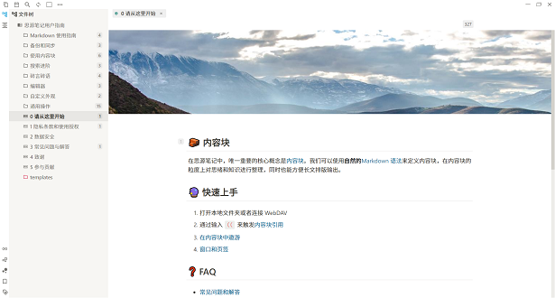

# Siyuan-theme-notion

## 预览图

## 简介

- 参考Notion的Light主题
- 所做的工作
  - 整体配色更改
  - 样式更改
    - 编辑器样式（与[Atom OneDark](https://github.com/zqhjl/Siyuan-Atom-OneDark)主题大部分一致）
    - UI样式
      - 主要是各类页签列表的悬浮、选中、点击等效果
  - 整体字体更换

## 历史版本

### 0.6.1

- 重构了UI按钮动效的代码
- 更改编辑器内选中文字的底色
  - 以及靠块标识选中的底色
- 修改了"===="语法的高亮底色
- 调整富文本工具栏项目的的内边距
  - 并取消富文本工具栏整体的内边距
- 增加了编辑器页签的外下边距
- 增加了滚动条在鼠标悬停时的效果
- 修改了标题块的块标识的位置
- 修复了mermaid内部元素渲染的问题

### 0.5.1

- 修复侧栏和编辑器页签动效
- 修改标题块的样式

### 0.4.9

- 修复vditor-ir--tip类选择器失效的问题
- 修复隐藏工具栏的前提下工具栏显示的问题

### 0.4.7

- 更换图片阴影
- 修复按钮底色
- 修复侧边栏悬浮效果
- 更改几种卡片的样式